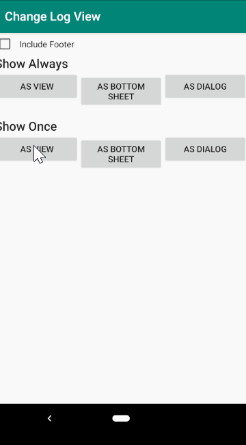
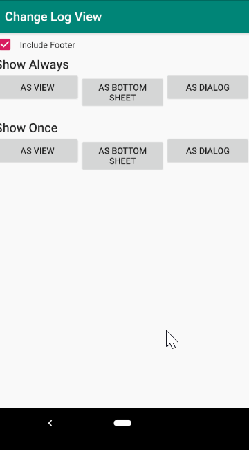

## Android Change Logs View
100% Customizable View to display your application Release Notes

----
#### Preview

|  |  |
| ------------- | ------------- |

----
#### Installation
Add it in your root build.gradle at the end of repositories:
````groovy
allprojects {
	repositories {
		maven { url 'https://jitpack.io' }
	}
}
````
Add the dependency
````groovy
dependencies {
    implementation 'com.github.xeinebiu:android_view_changelogs:1.0.3'
}
````


----
#### Builder

##### Properties
> asBottomSheet() - Show Releases on a Bottom Sheet

> asDialog() - Show Releases on a Dialog

> asView(ViewGroup) - Show Releases on a ViewGroup

> withLimit(Int) - Limit amount of Release notes to show

> withFooter(Int) - Display [View] as Footer

> withReleaseDivider(Int) - Set the [layoutId] to use as divider between Release's

> withReleaseNote(Int) - Set the [layoutId] to use for Release Note

> withReleaseTitle(Int) - Set the [layoutId] to use for Release Title

> withHeaderText(String) - Set a text to display on the header

> withHeader(Int) - Set the [layoutId] for Header
----
Show Release Notes using default options
````kotlin
ChangeLogManager.Builder.with(this, getString(R.string.changelogs))
                .asDialog()
                .build()
                .show()
````


----
Use ```showOnce()``` to show the Release Notes only once per version
````kotlin
class MainActivity : AppCompatActivity() {
    override fun onCreate(savedInstanceState: Bundle?) {
        super.onCreate(savedInstanceState)
        setContentView(R.layout.activity_main)
        ChangeLogManager.Builder.with(this, getString(R.string.changelogs))
            .asDialog()
            .build()
            .showOnce()
    }
}
````


---
#### Supported Formats
> Plain Text
````
# 1.1.0
Publish to Git
Bug fixes
# 1.0.0
Hello world App
````

----
##### Follow the demo application for more Usage Examples

#### Author
> xeinebiu
